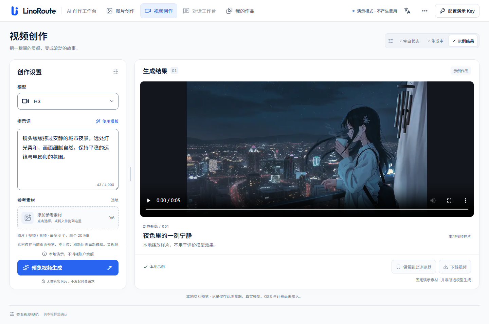
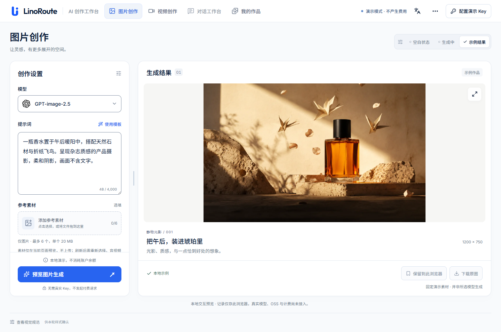
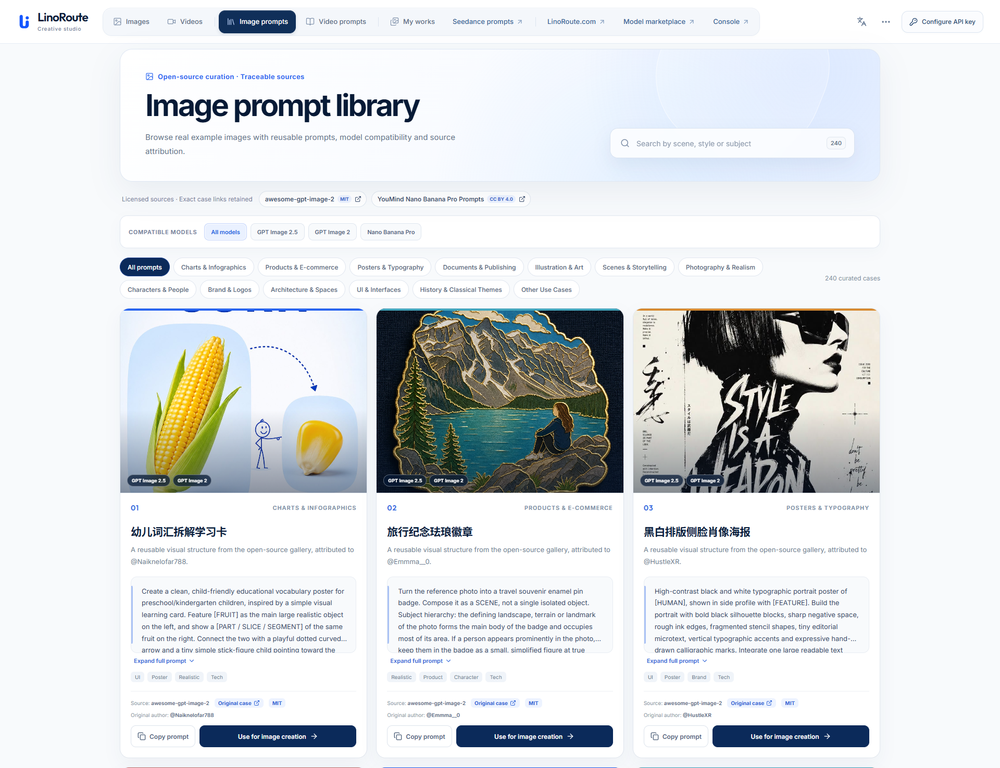
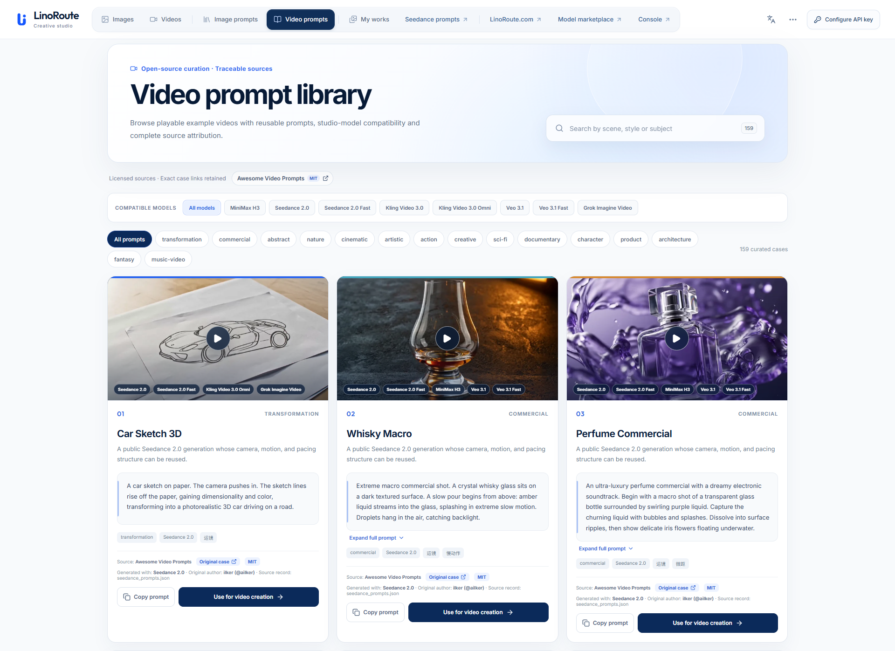

# LinoRoute Studio

LinoRoute Studio 是一个开源的图片与视频 AI 创作工作台，支持文生图、图生图、文生视频、图生视频、提示词库以及浏览器本地作品管理。

语言： [English](README.md) · 简体中文 · [日本語](README.ja.md) · [한국어](README.ko.md) · [Español](README.es.md) · [Français](README.fr.md)

最近更新：[更新日志 / Changelog](CHANGELOG.md)。

## 在线体验

- **在线演示：** [studio.linoroute.com](https://studio.linoroute.com)
- **推荐兼容 API：** [LinoRoute](https://linoroute.com)
- **API 文档：** [ninoroute.com/tutorials](https://ninoroute.com/tutorials/00-intro)

不配置 Key 也可以浏览界面和提示词库。真实生成需要用户自行填写 API Key。项目默认适配 LinoRoute；更换服务商时需要核对模型名、接口路径和响应格式，不能仅靠更换地址保证兼容。

## 安装与使用

如果客户端支持从 GitHub 安装 Skill，可以安装
[`skills/linoroute-studio`](skills/linoroute-studio/) 作为总入口；图片、视频和提示词 Skill 可以按需单独安装。如果客户端要求 ZIP，请使用 GitHub Release 中对应的压缩包，不要上传整个仓库。

WorkBuddy 用户在 Skill 和连接器发布审核通过后，从 WorkBuddy 中安装两者即可：Skill 负责模型和参数判断，连接器负责实际 API 调用。连接器地址使用
`https://mcp.linoroute.com/mcp`，API Key 由用户自行填写。GitHub 地址只是源码或安装参考，不能替代 WorkBuddy 自己的安装流程。

可以把下面这句话复制给支持对话式安装的客户端：

> 请安装 LinoRoute Studio Skill；需要生成图片或视频时连接 https://mcp.linoroute.com/mcp，如果尚未配置就提示我填写自己的 LinoRoute API Key。

是否能真正自动安装，取决于客户端是否提供 GitHub 或软件包安装动作；Skill 不会静默下载自己，也不会内置公共 API Key。

## 截图










## 功能

- GPT-image 系列图片生成与参考图输入
- Seedance、MiniMax、Kling、Veo、Gemini 等视频模型
- 文生图、图生图、文生视频、图生视频
- 根据模型联动画面比例、分辨率、画质和时长
- 图片与视频提示词库
- 浏览器本地作品和本地文件管理
- 可选的签名 OSS 上传，用于临时保存素材与结果；提示词预览使用独立的长期存储桶
- 英文优先界面，支持中文切换；文档提供六种语言
- 不内置服务器主 API Key 的安全中转模式

## 隐私与密钥

Studio 采用用户自带 Key 的方式。API Key 由用户输入，只随需要它的请求发送。不要将 Key 提交到仓库、写入 `VITE_*`/`NEXT_PUBLIC_*` 变量，或粘贴到 Issue 中。

Key 保存在当前标签页的 `sessionStorage` 中，刷新后仍可使用；这不是 Cookie，也不是云端账号。作品记录保存在浏览器 IndexedDB 中，不跨设备同步。公共电脑使用后请断开 Key；部分浏览器的会话恢复功能也可能恢复标签页存储。

OSS 使用短时签名 URL。OSS AccessKey 只能放在服务端签名器中，不能进入浏览器构建产物。详见 [`SECURITY.md`](SECURITY.md) 和 [`docs/provider-adapters.md`](docs/provider-adapters.md)。

## 本地运行

需要 Bun 1.4.2 和 Node.js 24+；可选的 OSS 服务需要 Python 3.11+：

```bash
bun install
cp .env.example .env.local
bun run dev
```

打开 `http://127.0.0.1:4178`。默认上游为 `https://linoroute.com`，也可以通过 `STUDIO_API_UPSTREAM` 更换为其他兼容服务。

上游地址不带 `/v1` 或末尾斜杠。生产部署还需要 API 转发服务；仓库已包含 Nginx 配置、OSS 签名服务和空白密钥模板，详见[部署说明](deploy/studio/README.md)。上传签名有效期为 5 分钟，读取链接为 7 天；OSS 生命周期删除规则需另外配置。

```bash
bun run typecheck
bun run test
bun run build
```

## 许可证

项目使用 [GNU AGPL v3 或更高版本](LICENSE)。部分 UI 源自 QuantumNous 的 new-api Web 客户端，相关版权头和许可证义务仍然保留。品牌、模型 Logo 和提示词素材的说明见 [`NOTICE`](NOTICE)。
